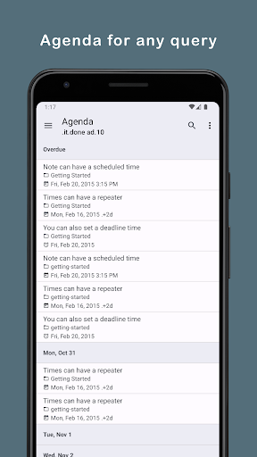
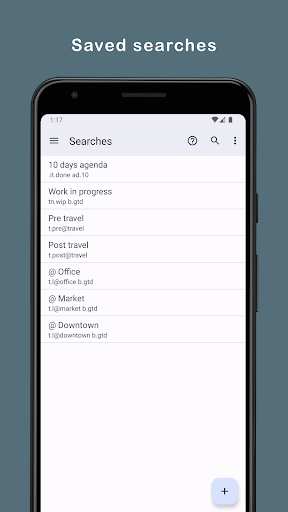
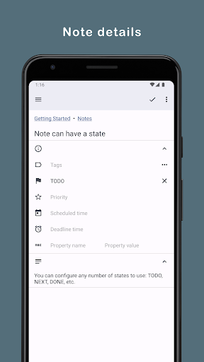
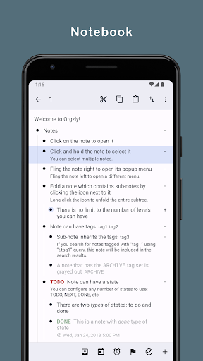
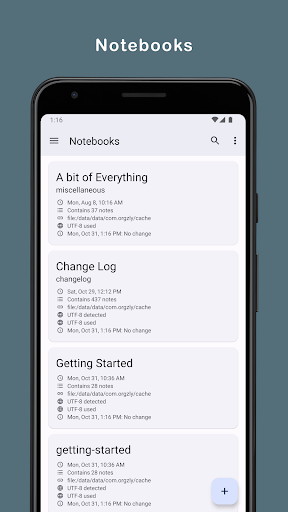
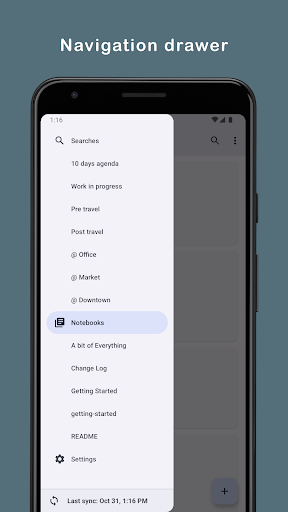

## Introducción

El caos mental tiene solución, y se llama **Org Mode**.

Cuando iba a la universidad, como muchos otros, era desordenado. En especial cuando de tareas, actividades y exámenes se trataba. No tenía un buen sistema de orden y muchas veces no estudiaba para una prueba o simplemente no recordaba dónde había dejado una nota. Me encontraba buscando en veinte pestañas de navegador archivos que había perdido, frustrado, hasta que me plantée reorganizarme.

Mientras investigaba en internet buscando soluciones a mi "mágico desorden", estaba en mi transición de **VIM** a **GNU Emacs**. En un foro me recomendaron **Org Mode** y ahí empezó toda esta organización para mi día a día. Descubrí sus múltiples módulos: agenda, capture, tablas, código ejecutable con Babel y gestión de citas.

Uno de los mayores desafíos fue mantener mis archivos sincronizados entre mi computador de sobremesa, el laptop de la universidad y mi teléfono. Ninguna herramienta que probé funcionó bien hasta que encontré la combinación perfecta: **GNU Emacs** + **Org Mode** + **Syncthing**.

## Mi viaje con GNU Emacs y Org Mode

Antes de descubrir **Org Mode**, estaba en medio de una transición que cambió mi forma de ver los editores: migrar de **VIM** a **GNU Emacs**. Venía de años usando VIM y su configuración en vimrc, pero sentía que necesitaba algo más flexible y personalizable.

**GNU Emacs** me abrió un mundo nuevo: la posibilidad de programar en el mismo editor que usaba. Empecé a escribir scripts en Lisp para mi configuración personal, pequeñas funciones que automatizaban tareas repetitivas y mejoras que hacía a medida que descubría qué necesitaba.

### Descubriendo Org Mode

Un día, navegando en un foro de internet, vi que le recomendaban a otra persona utilizar **Org Mode** para organizarse. Curioso, investigué qué era y descubrí que era un nuevo mundo dentro del mismo **GNU Emacs**. Ya de por sí existe la broma de que Emacs es un sistema operativo, pero **Org Mode** lleva las cosas a otro nivel: un sistema de escritura para organizar tus archivos, tus notas, tus planes, tu agenda y muchas cosas más.

Una de las cosas que más agradezco de **GNU Emacs** es que viene con manuales integrados. Esto me facilitó mucho entender cositas de **Org Mode** al principio. Empecé a hacer mis trabajos de la universidad, tareas y entregables en él, dejando de lado a LibreOffice casi en su totalidad. Solo necesitaba organizar con una sintaxis muy simple: niveles, contenido y demás acciones dentro del documento.

### Sintaxis simple y exportación

Por ejemplo, una lista de tareas en la universidad la podía tener de esta manera:

```org
* Proyecto de Tesis
** TODO Revisar bibliografía [1/3]
  - [ ] Buscar libros en la biblioteca
    - sistemas operativos
    - compiladores
    - arquitectura de computadores
  - [ ] Revisar artículos académicos
    - IEEE papers
    - libros de texto
    - artículos de investigación
  - [X] Tomar notas de las fuentes principales
    - notas del libro 1
    - notas del artículo 2
    - resumen de capítulo

** TODO Escribir capítulo 1 [0/3]
  - [ ] Hacer esquema del capítulo
    - introducción
    - desarrollo
    - conclusión
  - [ ] Redactar introducción
    - contexto
    - problema
    - objetivos
  - [ ] Desarrollar argumentos principales
    - argumento 1
    - argumento 2
    - argumento 3

*** DONE Revisar fuentes [1/1]
  - [X] Todas las fuentes verificadas
    - fuente 1
    - fuente 2
    - fuente 3

*** TODO Escribir resumen [0/1]
  - [ ] Síntesis de 500 palabras
    - idea principal
    - conclusiones clave
    - referencias principales

** DONE Preparar presentación [2/2]
  - [X] Crear slides en Beamer
    - title slide
    - contenido
    - conclusión
  - [X] Preparar notas del presentador
    - puntos clave
    - timing
    - preguntas

** WAIT Corrección del tutor [0/1]
  - [ ] Esperando retroalimentación
    - revisar comentarios
    - ajustar contenido
    - preparar segunda versión
```

Con solo estos elementos (\*, -, [ ], [X]) ya tienes una estructura organizable, exportable y visible en la agenda de **GNU Emacs**.

Y un ensayo se estructura simple:

```org
* Ensayo: El impacto de la tecnología
** Introducción
  La tecnología ha transformado la sociedad...
** Desarrollo
*** Primer punto: Comunicación
  Antes de internet, la comunicación era lenta...
*** Segundo punto: Educación
  Las plataformas digitales han cambiado la forma de aprender
** Conclusión
  En resumen, la tecnología ha transformado nuestras vidas
```

Lo mismo aplica para notas de clase, documentación de proyectos, o cualquier documento. La misma sintaxis sirve para todo, y lo mejor: se puede exportar a PDF, HTML, ODT y muchos otros formatos con un solo comando.

### Beamer y otros módulos

Pero Org Mode no solo sirve para documentos escritos. Aprendí a hacer mis presentaciones para exposiciones con **Beamer**, entre muchos otros módulos que me permitían organizarme a nivel del mismo **GNU Emacs**.

Al principio, depender de la agenda me obligaba a revisar constantemente mis anotaciones en mi libreta física o las notas de mi teléfono para poder agregar todo dentro de **GNU Emacs**. Esa dependencia me llevó a buscar una solución para sincronizar todo sin tener que hacer ese paso manual cada vez.

## Orgzly: Org Mode en mi teléfono

En mi búsqueda por solucionar el problema de sincronizar todas mis notas físicas y no depender tanto de mis libretas y notas sueltas — ya que a veces ni llevaba las libretas —, busqué aplicaciones de teléfono que utilizaran el formato de **Org Mode**. En ese entonces era una aplicación que recién había llegado a la Play Store: **Orgzly**. Recuerdo que me emocionó mucho saber que existía algo así para Android.

Para mí, **Orgzly** era como llevar el módulo de agenda de **Org Mode** en mi teléfono. Me permitía crear mis anotaciones, alarmas y muchas más cosas dentro del mismo dispositivo. Lo mejor era que trabajaba con archivos con extensión .org, lo que significaba que podía conectar mi teléfono por cable o enviar la información de varias formas entre el teléfono y las diferentes computadoras que tenía.

### Mi experiencia con Orgzly

Al principio era muy práctico: tomaba mis apuntes en mi teléfono mientras estaba en la universidad, creaba las alarmas con las diferentes tareas del día a día y yo solo iba marcando las tareas que ya tenía listas. Era un flujo de trabajo simple y efectivo.

Aquí unas fotos sacadas de internet de cómo se ve actualmente:

|  |  |       |
| :---------------------------------------------------------------------: | :------------------------------------------------------------: | :-----------------------------------------------------------: |
|                |             |  |

## Syncthing: Servidor P2P para sincronización

Sin embargo, con el tiempo fueron surgiendo nuevos desafíos. No podía sincronizar todo todos los días. No podía estar encendiendo la computadora constantemente, porque en aquel momento en Venezuela comencé a tener muchos problemas con la luz e internet. Simplemente no me podía dar el lujo de tener que encender la PC solo para pasarme los datos de mi teléfono, organizar la información y armar mi planificación del día o semana.

### Antes de Syncthing: Dropbox y sus problemas

Antes de encontrar **Syncthing**, intentaba utilizar las opciones de sincronización que **Orgzly** ofrecía a través de internet, como Dropbox. Sin embargo, con las constantes fallas de internet en Venezuela, las sincronizaciones me fallaban constantemente. Podía tener días sin sincronización porque me había quedado sin internet, lo que frustraba todo mi sistema de organización.

### El descubrimiento: servidores P2P

Fue entonces cuando investigando encontré un vídeo sobre servidores **P2P**. Ya había visto los servidores **P2P** en la universidad, pero esto me dio la idea definitiva de usarlos para mi sistema de organización. La idea me llamó la atención porque no dependía de un servidor centralizado en la nube. Tenía una batería (UPS) donde conectaba mis equipos y el router, lo que me permitía mantener todo siempre en mi red local. Esto me daba la posibilidad de tener todo sincronizado, tanto local como por internet, sin depender de una conexión externa constante. Antes no se me había ocurrido aplicar esto a mi flujo de trabajo con **Org Mode** y **Orgzly**.

Fue así como encontré **Syncthing**, en un rincón de internet.

### Por qué fue la solución

- Sincronización automática entre dispositivos
- Funciona en segundo plano (sin necesidad de acciones manuales)
- No requiere un servidor centralizado como Dropbox
- Protocolo P2P directo entre dispositivos
- Funciona perfectamente en red local gracias a la batería (UPS)
- Sincroniza incluso cuando la conexión a internet es intermitente

### ¿Qué tan fácil fue usar Syncthing?

Syncthing fue muy sencillo de utilizar. Solo necesitaba:

1. Instalarlo en cada dispositivo
2. Configurar los diferentes dispositivos
3. Compartir los hashes entre ellos
4. Compartir los directorios que yo necesitaba

Y listo. Esto me dio la posibilidad de cualquier modificación de mi día a día en cualquiera de mis equipos, todo sincronizado.

## Palabras finales

A día de hoy sigo utilizando este método de organización para mi día a día. Con **GNU Emacs** gestiono todas mis notas con **Org Mode**: trabajo, personal, los posts para mi blog, mis historias que me invento por ahí. Después paso todo a un PDF y se lo envío a algún amigo para que lea o me ayude como editor cuando tenga tiempo.

Manejo los recordatorios y avisos con **Orgzly** en mi teléfono, además de editar los archivos de mis posts cuando algo se me ocurre desde el mismo, o corregir mis escritos para mis historias. Todo esto manteniendo sincronizado para mi día a día con **Syncthing**.

Aunque sé que existen otros métodos que pueden ser mejores, esto me ha funcionado correctamente por poco más de una década. Y como solemos decir: si funciona, no lo toques.

> Recuerda: Si funciona, no lo toques.
