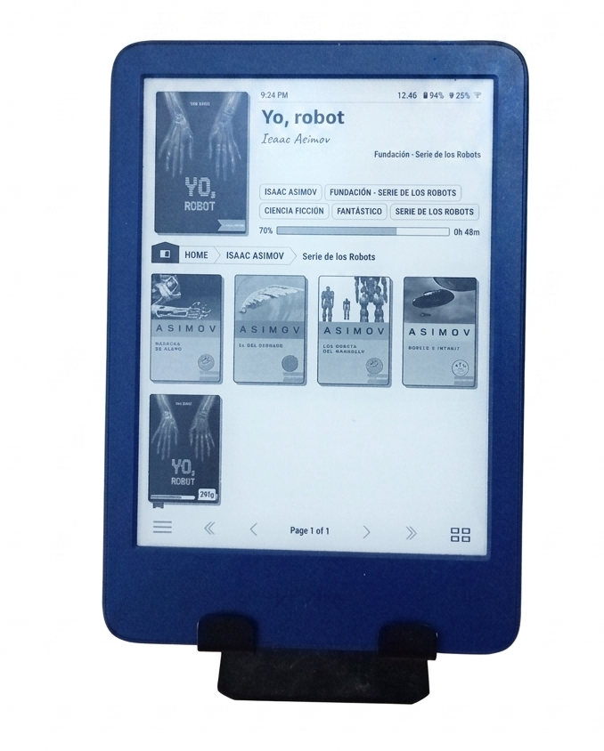
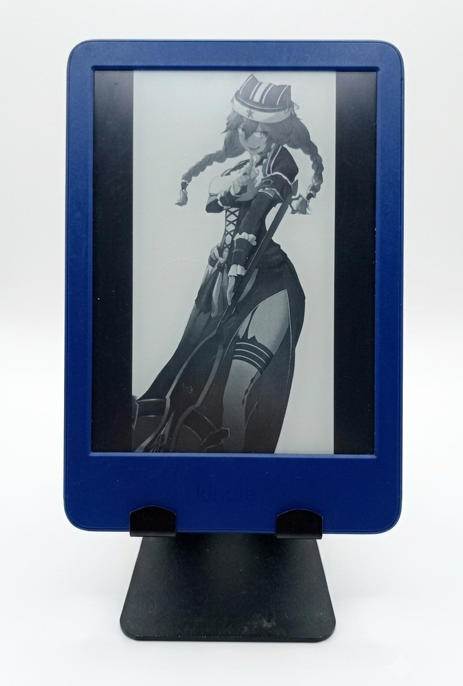

## Introducción

Durante mucho tiempo fui de los que leía en el teléfono, en la computadora, en una tablet o con un buen libro físico. Probaba de todo, pero en ningún lado encontraba la comodidad que buscaba para leer por horas. Usaba aplicaciones como **KOreader** o **Moon+Reader** en el teléfono, pero con el tiempo empecé a notar lo que muchos terminan notando: fatiga visual, distracciones constantes con notificaciones, y la incomodidad de algunos libros físicos que son muy grandes y acumulan polvo en la casa. Esa sensación de que ningún dispositivo ni formato estaba realmente pensado para mí.

Había escuchado maravillas de los e-readers: la pantalla E-Ink (tinta electrónica), la batería que dura semanas, la ausencia de luz azul directa. Pero también había escuchado las críticas: los ecosistemas cerrados, las limitaciones de formatos, el DRM. Durante meses estuve entre la espada y la pared, sin decidirme entre un **Kindle**, un **Kobo** o un **PocketBook** porque era una decisión muy difícil de tomar entre alguno de ellos, uno por la fama, otro por la libertad, otro por los muchos formatos que soporta, etc.

Finalmente vi la publicación en una tienda en línea de un Kindle de segunda mano económico y me animé a hacer la prueba. Lo compré, fui directo a la tienda ese mismo día, y cuando lo tuve en mis manos supe que había tomado la decisión correcta. Estaba maltratado físicamente, con rayones y la mayor parte de los caracteres de la carátula casi borrados, pero fue amor a primera vista por su llamativo color azul.

## Por qué el Kindle básico

Para ser honesto, la decisión fue más económica que técnica. Me costó cerca de 35$ por ser de segunda mano, comparado con los $130 USD que cuesta nuevo o los $180 del Paperwhite. A ese precio, ni lo dudé. La pantalla del básico es de 6 pulgadas a 300 PPI -la misma densidad de píxeles que el Paperwhite- así que en nitidez no iba a perder nada -y eso que me ofrecieron uno por 70$ pero por miedo a que no me gustara leer en estos dispositivos, rechacé la oferta en la misma tienda-. La diferencia principal con el Paperwhite es la luz cálida ajustable y la resistencia al agua, cosas que no necesitaba. Algo que sí me impresionó desde el principio fue lo ligero que es: mi teléfono pesa 181g pero el Kindle solo 158g. Al principio no le di importancia, pero con el pasar del tiempo agradezco que pese esos gramos menos que mi teléfono por las sesiones largas de lectura.

Las otras opciones como Kobo estaban fuera de mi alcance en ese momento ya que encargarlo por internet me iba a tomar mucho más tiempo y las ansias de tener ya un dispositivo en mis manos me ganó, así que el Kindle básico era la mejor opción. Y la verdad, no me arrepiento de que sea éste mi primer dispositivo.

## Primeras impresiones

Al ser de segunda mano, nunca lo saqué de la caja -o de la bolsa en la que me lo entregaron- con ese ritual de estrenar dispositivo. Solo lo encendí y empecé a usarlo. Pero aun así me sorprendió lo ligero que era. Con 158 gramos, se siente casi irreal tenerlo en las manos. La pantalla es un alivio comparado con el brillo del teléfono, y la iluminación frontal, aunque solo es blanca, es suficiente para leer en la oscuridad, si tienes pareja y eres de leer en las noches, tu pareja te agradecerá que no sea una luz tan fuerte, apenas lo suficiente para que solo tú puedas leer sin molestarla.

La configuración inicial, si no se hace con la ayuda de la app en el teléfono, es para querer matarse de lo lento que resulta hacerlo desde el dispositivo. Escribir usuario y contraseña con el teclado en pantalla del Kindle es una tortura. Así que si no tienes paciencia -como yo- hazte el favor y usa la app.

Lo que me chocó al principio fue lo "lento" que se siente comparado con un teléfono o una tablet. La tinta electrónica tiene un refresco más lento, y eso se nota al pasar páginas o navegar por la tienda. Pero es algo a lo que te acostumbras rápido, y a cambio obtienes una experiencia de lectura que se siente más cercana al papel que a una pantalla.

## El día a día

Durante los primeros meses usé el Kindle tal como venía de fábrica. La experiencia era buena para lo básico: comprar libros en la tienda de Amazon, leerlos, subrayar pasajes, consultar el diccionario, tomar anotaciones. La batería, para ser un equipo de segunda mano y ya tener cuatro años a la fecha, tiene simplemente una duración más que excelente, con una sola carga y mis periodos de lectura nocturnos de unas 2 horas, me ha llegado a durar unas 3 semanas hasta llegar al 30%, que es cuando lo pongo a cargar. Esto para cuidar la batería -aplica con casi cualquier batería, no la dejes bajar del 30%-. Podía leer sin sentir que tenía un par de huevos fritos por ojos, y lo llevaba a todos lados sin pensar en cargarlo.

Pero con el tiempo empecé a chocar con las limitaciones del ecosistema de Amazon. Los libros que ya tenía en EPUB no los podía pasar directamente -hay que convertirlos a MOBI o AZW3 con Calibre y enviarlos por correo o USB-. Los marcadores y la sincronización funcionaban bien solo si comprabas todo en Amazon.

Además, hay ajustes que Amazon simplemente no te deja cambiar. Cosas que parecen triviales como los screensavers: el Kindle solo muestra imágenes promocionales de libros o anuncios -a menos que pagues $20 extra para quitarlos-, y no puedes poner tus propias imágenes de fondo. Tampoco puedes personalizar las fuentes más allá de las que vienen preinstaladas ni ajustar márgenes a tu gusto.

Fue entonces cuando empecé a investigar sobre el jailbreak.

## El jailbreak

El jailbreak de los Kindle no es nuevo. La comunidad lleva años haciendo ingeniería inversa al software de Amazon para liberar estos dispositivos. Nombres como **NiLuJe**, **marek**, **Penguins184** o los desarrolladores de **KOreader** son leyendas en este mundillo y te invito a que leas la [página](https://koreader.rocks/) de estos ultimos.

Además de contar con una comunidad muy activa detrás, se puede hacer prácticamente lo que quieras en tu Kindle. Hay emuladores de GameBoy, reproductores de música -aunque no tengas parlantes en tu Kindle, lo conectas por Bluetooth y reproduces de igual forma-, existen juegos, y muchas apps que la comunidad se ha animado a hacer.

El proceso para mí Kindle 11ª generación (modelo KT5) fue más sencillo de lo que esperaba, gracias a la herramienta **SpringBreak** creada por el desarrollador **Penguins184**. El exploit combina varias técnicas: inyecta HTML personalizado en la tienda de Kindle aprovechando un bug con miles de carpetas anidadas que el sistema no puede eliminar, usa la API interna del dispositivo para comunicarse con servicios del sistema, y finalmente ejecuta código como root aprovechando una aplicación de Kindle Kids+ que tenía acceso a funciones críticas. Si te interesa un poco más el tema, puedes leer lo que comenta **Penguins184** en su [post](https://penguins184.xyz/blog/springbreak-jailbreak/)

Los pasos que seguí están en la página oficial de [SpringBreak en KindleModding](https://kindlemodding.org/jailbreaking/SpringBreak/), y la verdad, todo el proceso me tomó cerca de 10 minutos -creo que menos- siguiéndolos al pie de la letra.

La herramienta lo deja tan fácil que al final solo usas el gestor de paquetes **kpm** y con ello instalas **KOreader** muy fácilmente. En el buscador del mismo Kindle solo terminas escribiendo `;kpm install koreader` y por medio del WiFi, te descarga e instala **KOreader**.

Ahora, si quieres hacer el jailbreak, las webs que yo terminé siguiendo fueron solo dos: [kindlemodding.org](https://kindlemodding.org/) y [kindlemodshelf.me](https://kindlemodshelf.me/). En esta última está la sección que más me interesaba, la galería de imágenes que van subiendo constantemente: [kindlemodshelf.me/images](https://kindlemodshelf.me/images).

## La vida post-jailbreak

Con **KOreader** el Kindle se transformó por completo. De repente tenía soporte para:
- **EPUB nativo** - Sin necesidad de convertir los libros.
- **PDF con reflow** - El texto se reacomoda al tamaño de la pantalla, algo que el software nativo hace muy mal.
- **CBZ/CBR** - Ahora podía leer cómics y mangas más cómodamente.
- **Estadísticas de lectura** - Tiempo por sesión, velocidad, páginas restantes.
- **Ajustes de pantalla** - Contraste, brillo, temperatura de color (hasta cierto punto), márgenes, interlineado, lo que quisieras.
- **Gestión de libros por carpetas** - Sin necesidad de pasar por Calibre. Solo creé un directorio y se lo asigné a **KOreader** como el principal, así el mismo reconoce toda la información del libro, descripción, autor, saga, título, fecha de publicación, vamos, toda la metadata que tenga el libro.

Además, investigando en internet me encontré con que recomendaban usar **KindleForge**, una especie de "app store" para estos scripts dentro del Kindle. Pero al instalarla me percaté de que apuntaba a un dominio que no está habilitado a día de hoy, así que dentro del repositorio donde está el código estaba la solución: [el repositorio del repositorio](https://github.com/KindleTweaks/Repository) -sí, así se llama-. Ahí se pueden ver los scripts que ofrece y el que me interesaba era **ToggleAds**. Al leer su `install.sh` vi que solo es un curl que descarga el script y lo ejecuta, así que me salté ese paso por no tener la "app store" disponible, me descargué su script principal y lo agregué al Kindle. Luego de eso, aunque me quitó la publicidad, no fue del todo efectivo porque había quedado habilitada una opción que bloqueaba dentro de **KOreader** unas opciones -capricho mío por querer cambiar los screensavers-, por lo que me tocó descargar el script de **DisableAds** de [scriptlets.notmarek.com](https://scriptlets.notmarek.com/).

Una vez removida la publicidad, **KOreader** desbloqueó una opción: en Config (el engranaje), en la opción de Screen, se desbloqueó la opción "Sleep screen", la que me permite cambiar los diferentes screensavers que puede tener mi Kindle -¡lo amo!-. Así que para tener cierto orden, dentro del Kindle cambié la ubicación de los libros y los moví dentro del directorio de `koreader/Books` y creé el directorio en donde guardar mis screensavers dentro de `koreader/screensaver`. Ya con eso **KOreader** no solo reconoce toda la información de mis libros, sino que también coloca los diferentes screensavers que yo descargué y agregué dentro.

**KOreader** tiene hermosos plugins, pero yo me decanté por [Bookshelf](https://github.com/AndyHazz/bookshelf.koplugin), un plugin que te permite organizar y gestionar tu biblioteca de una forma más visual y ordenada dentro del mismo **KOreader**.

## Riesgos y consideraciones

No todo es color de rosa. El jailbreak tiene sus riesgos:

- **Garantía** - Si algo le pasa al Kindle, Amazon puede negarse a repararlo si detectan el jailbreak. Aunque se puede revertir formateando el dispositivo.
- **Estabilidad** - **KOreader** es estable, pero de vez en cuando alguna actualización del firmware de Amazon puede romper algo. Por eso es importante no actualizar sin antes verificar que el jailbreak sobrevive.
- **Batería** - El software nativo de Amazon está optimizado para gastar lo mínimo. **KOreader** consume un poco más, aunque nada dramático.
- **Complejidad** - No es un proceso para todos. Si no te sientes cómodo copiando archivos en la terminal o investigando en foros, quizá no vale la pena.
- **Riesgo de brick** - Aunque no es común, la misma comunidad advierte que te puedes quedar con un lindo pisapapeles si algo sale mal.

En mi caso, el jailbreak valió cada segundo que le dediqué. Las limitaciones que me molestaban del software de Amazon desaparecieron, y ahora tengo un lector que hace exactamente lo que quiero. Y lo que quería originalmente era NO VER ESA PUBLICIDAD.

## Conclusión

El Kindle 11ª generación básico es un excelente dispositivo por sí solo. Es ligero, tiene buena pantalla, batería duradera y cumple con lo básico. Pero si quieres sacarle todo el jugo posible, el jailbreak es el camino.

Mi experiencia con el jailbreak fue positiva. No es complicado si sigues las guías de la comunidad, y los beneficios son enormes. **KOreader** solo justifica el proceso: el soporte de EPUB nativo -no solo EPUB, también los cómics y mangas-, las estadísticas, la gestión de PDF y la personalización hacen que el Kindle se sienta como un dispositivo completamente diferente.

Hoy en día lo uso a diario. Lo llevo a todas partes, leo libros que compro y otros que me regalan mis amigos de internet, y la experiencia es exactamente lo que quería cuando decidí comprar un e-reader: leer sin distracciones, sin limitaciones y sin que me impongan cómo hacerlo.

Y aquí una visual de como se ve ahora mi Kindle:

> Un Kindle con jailbreak no es un Kindle. Es el lector que Amazon nunca te dejó tener.
